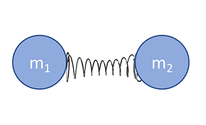
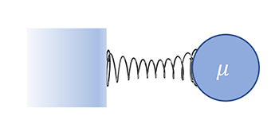

# Week 2 Problem Set

For this homework set, you will be writing a Python class to represent a harmonic oscillator. 
The concept of a harmonic oscillator plays a crucial role in both classical and quantum physics. 
In the context of chemistry, the classical harmonic oscillator serves as a useful model for describing the equilibrium behavior of molecular bonds.

This assignment consists of two main parts:

Background and Equations: The first section will provide you with the theoretical background and the necessary equations to model a harmonic oscillator. 
You are encouraged to understand these equations, as they form the basis of the code you will write.

Specifications: The second section outlines the specific requirements for the Python class you will create, including the methods to implement and additional features like custom exceptions and testing.

By completing this assignment, you will gain hands-on experience in object-oriented programming, 
learn to implement scientific equations in code, and understand a basic model commonly used in computational chemistry.

## Background: Diatomic Molecules - The Harmonic Oscillator

The behavior of molecular bonds is frequently modeled using a 
[harmonic oscillator](https://en.wikipedia.org/wiki/Harmonic_oscillator),
a classical system also known as a "mass on a spring."
This system is governed by Hooke's Law,
which states that the force exerted by the spring, $F(x)$,
is directly proportional to the displacement $x$ from its equilibrium position
and inversely proportional to the spring constant $k$:

$$
F(x) = -kx
$$

The potential energy $U(x)$ of a harmonic oscillator is given by:

$$
U(x) = \frac{1}{2} kx^2
$$

In the context of chemistry,
the simplest molecule with a bond is the diatomic molecule,
which consists of two atoms.
We can model this diatomic molecule as two masses connected by a spring,
as described by the equations above.

  

**Figure 1**: The bond as two masses on a spring.

To simplify calculations,
we will treat the diatomic molecule as a single "reduced mass" $\mu$
connected to an infinitely heavy mass.
The reduced mass is calculated using:

$$\mu = \frac{m_1m_2}{m_1+m_2}$$ 

 

 

**Figure 2**:  Representation of the diatomic molecule as a reduced mass system.

For this homework assignment,
you will create a Python class named `Diatomic`.
The class should include methods to calculate force, 
potential energy, 
kinetic energy,
and the total energy of the system.

The kinetic energy $K(v)$ is given by:
$$
K(v) = \frac{1}{2} \mu v^2
$$

The total energy $E_{\text{total}}$ of the harmonic oscillator is the sum of the kinetic and potential energies,
and will remain constant:
$$
E_{\text{total}} = K(v) + U(x)
$$

For a classical harmonic oscillator,
the position $x(t)$ and velocity $v(t)$ as functions of time $t$ are described by:
$$
x(t) = A \cos(\omega t + \phi)
$$
$$
v(t) = \frac{d x(t)}{d t} = -A \omega \sin(\omega t + \phi)
$$

In these equations,
$A$ is the maximum amplitude,
calculated as 
$$A=\sqrt{2\frac{E_{\text{total}}}{k}}$$

$$\omega = \sqrt{\frac{k}{\mu}}$$

and $\phi$ is a phase constant that depends on the initial separation distance
and velocity, namely $x(0) = A \cos(\phi)$ and $v(0) = A \omega \sin(\phi)$.
You can get an expression for $\phi$ using these equations. **Hint** -
You can take a ratio to get $\phi$ as an expression of a tangent function. 
**Hint 2** - When using `atan` functions, `atan2` may be useful to account for signs.

## Specifications

### Object Oriented Programming

Because we don't yet know all of the strategies for writing Python classes, some aspects of this class may seem clunky. The parameters in this system are highly coupled (updating the position should update the velocity, the kinetic energy, and the potential energy). We will see later in the course how we can use other Python language features to make it simpler.

For now, create a class called `Diatomic`to follow the following specifications:

You may use anything in the Python Standard Library, NumPy, and Matplotlib for this assignment. 

1. The constructor should take a reduced mass, a force constant, an initial separation, and an initial velocity. These should all be stored as instance attributes.

1. The class should have instance methods `potential_energy`, `kinetic_energy`. These methods should not take any parameters besides `self`. They should use the data associated with the instance. The calculated values for these should be **returned**.

1. Use your methods from step 2 to add calculation of  $\omega$, $A$, and $\phi$ to the constructor. Store these as instance attributes according to the equations given above.

1. Add an instance method for computing the position at a certain time and an instance method for computing the velocity at a certain time using the analytical solution. Name these methods `analytical_position` and `analytical_velocity`. Note that these values only depend on model constants (`mass`, `k`, `amplitude`, etc), and not on separation distance or velocity.

1. Add a module `test_diatomic.py`. Create tests to
    - Check that your object is propery constructed.
    - Check the `kinetic_energy` and the `potential_energy` methods. 
    - Check the `analytical_position` and `analytical velocity` method. 

### Exceptions and Inheritance

1. Add a Custom Exception Type: 
    - Custom exceptions can serve multiple purposes. They can make it easier to understand what went wrong in your program, help you manage specific error cases that may not be handled by standard Python exceptions, or simply make your code easier to debug.
    - In the context of the `Diatomic` class, think about the logical or mathematical constraints in the system. For example, a bond length or velocity that falls outside of certain pre-defined or physically plausible limits could be a good candidate for a custom exception.
    - Create a custom exception that inherits from an appropriate Python `Exception` class. Name it in a way that it is descriptive and follows Python naming conventions.
    - Incorporate this custom exception into your class to handle a specific type of error condition. For instance, you might raise this exception if someone attempts to set a negative bond length or spring constant.
    - When raising this custom exception, provide a helpful error message that explains why the error occurred and suggests potential solutions or workarounds.

### Formatting and Makefiles
Create a Makefile which has the following targets:

1. `lint`: This target will run the `black` and `flake8` linters on your homework module. After running this target, you should not see any errors from either linter. Make sure to install these tools if you haven't already, and check that your code adheres to the formatting standards they enforce.

2. `test`: This target will use `pytest` to run your test cases. Ensure that all your tests pass. If any test fails, revisit your code and correct the implementation.

3. `plot`: This target will use Python (matplotlib) to create two plots: one for the analytical position vs time and another for the analytical velocity vs time. 
    - For both plots, the x-axis represents time, and the y-axis represents either the analytical position or velocity.
    - Plot at least two periods of movement. It is suggested to use time intervals of 0.1 for accurate results.
    - Save the plots as PNG files with the names `analytical_distance.png` and `analytical_velocity.png`.
    - Label both the plot and axes appropriately. 

### Documentation and Reflection
Create a `README.md` file in your repository. The README should serve two purposes:

**Project Description**: Provide a detailed description of what this project is all about. Explain the purpose of each file, how the code is structured, and most importantly, how to use the Makefile. Assume your audience is someone from GitHub who is not familiar with the assignment or what your repository accomplishes.

**Reflection Questions**: Answer the following questions in detail, and include them in your README.

1. Custom Error: Describe the custom error that you implemented. Why did you choose this specific error, and how is it relevant to the behavior of a diatomic molecule modeled by a harmonic oscillator?

1. Class Limitations and Design Choices: Discuss any limitations you think exist in your Diatomic class. Do you feel like different design choices could have been made to improve the class? If so, what are they?

1. Pattern Observations: What patterns have you observed in your distance and velocity plots? Can you explain why these patterns exist based on the underlying physics?

    
    

